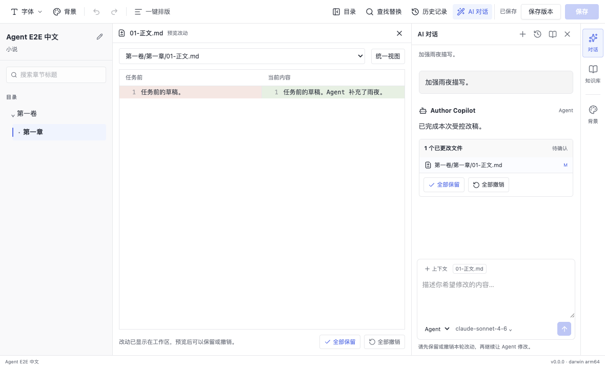

# Copilot 式 AI 对话与文件审核

## 用户行为

- 右侧只有一个 AI 对话入口。Ask 和 Agent 共用消息流、输入框和发送/停止操作，在输入框底部切换模式和 AI 连接。
- 顶部可新建对话、搜索历史、恢复对话、重命名及删除。历史按项目隔离，保存在桌面 userData 的 `conversations/<projectId>/<conversationId>.json`，通过受校验的 preload IPC 读取和原子写入。
- Ask 保持问答能力；Agent 以连续对话发起修改，携带前面的完整对话轮次、当前文件路径、选择行和上下文文件。两者都显示流式文字；发送 Agent 消息即授权这一轮项目 Markdown 文件操作。
- Agent 修改先显示在工作区。对话中的“已更改文件”列表可打开中央编辑区的差异预览，右侧聊天保持可见。预览支持并排/统一视图、行号和增删标色。
- “全部保留”确认这一轮修改并创建应用版本，“全部撤销”使用现有快照逆向恢复。文件被外部编辑后，原有摘要检查和回退冲突保护仍然生效。当前确认范围是整个任务，逐文件浏览不代表逐文件确认。
- 已保留、已撤销的历史记录保留差异用于查看，不再显示可重复执行的审核按钮。Agent 只回答而没有更改文件时自动关闭空快照，不需要确认。
- 取消、应用崩溃和重新打开项目后，未处理的快照重新关联到对应对话；没有历史关联的旧快照会显示为恢复的 Agent 对话。

## 实现与边界

移除了独立 Agent 表单及其授权复选框/时间设置。统一发送保留原有任务工具范围，默认每轮五分钟。单个项目同时执行一轮，待确认的文件修改完成审核后才能发起下一次 Agent 修改。Ask 仍需要选择当前文档。

历史文本不会无限注入模型：发送最近六个完整轮次，每条最多 8,000 字符；未完成的轮次不进入后续上下文，已撤销的修改会注明。Agent 的实际工具状态仍按任务隔离，多轮延续使用显式对话上下文。

单段历史最多 2,000 条消息、16 MiB，现有文件预览截断上限保留。历史保存失败会显示错误，不会静默清空；请求启动前先保存用户消息。逐字流式保存采用短暂合并，异常退出时最后一小段未落盘文字可能缺失。

旧“生成修改建议”按钮已退出对话主流程，原有 proposal 服务及契约测试继续保留，新的文件审核入口走 Agent 快照。未迁移旧 Ask 内存消息，因为此前没有可读取的持久化历史。

## 验证

- Desktop TypeScript 检查通过；Desktop lint 无 error，保留现有四条组件 Fast Refresh warning；Contracts lint 通过。
- Desktop 对话存储、上下文、差异预览、Agent 服务、流式事件、IPC 和 SDK 策略定向测试：32 项通过；快照服务另外 13 项通过。
- Contracts 全套原有 50 项中，新增 IPC 通道导致的固定数量断言已更新；相关 15 项重新运行通过，其余 35 项先前已通过。
- Desktop 构建通过。
- 5 条 Electron/Playwright 场景通过：Ask 流式/来源/历史管理与重新加载；Agent SDK 修改/预览/保留/取消/撤销/崩溃恢复；自定义供应商下 Ask 转 Agent；侧栏与工具栏；窄窗口布局与草稿保留。
- Agent 场景额外验证无文件修改的连续问答，确认无需手动结束空任务，并验证后续请求包含前文。
- 未运行依赖 Mongo/Redis 的平台计费联调，未做 Windows 打包验收；模型回复使用本地模拟服务，原生 Agent SDK 和文件工具链真实执行。

