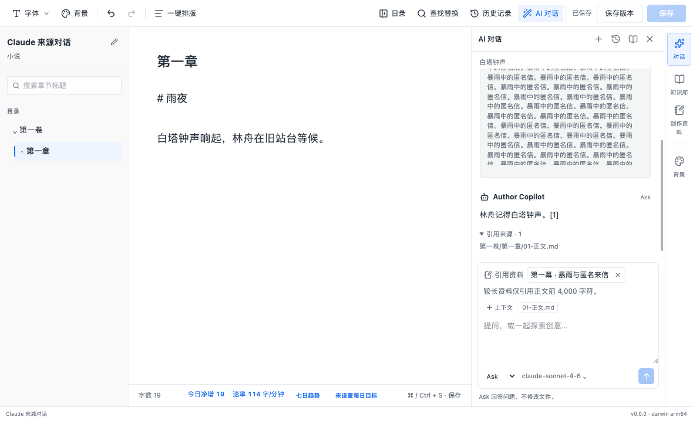
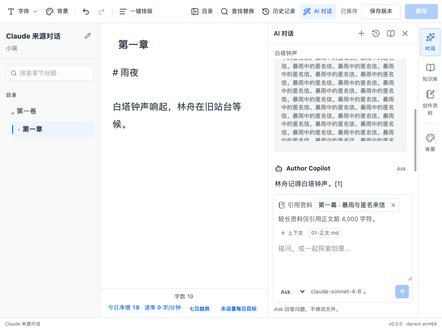
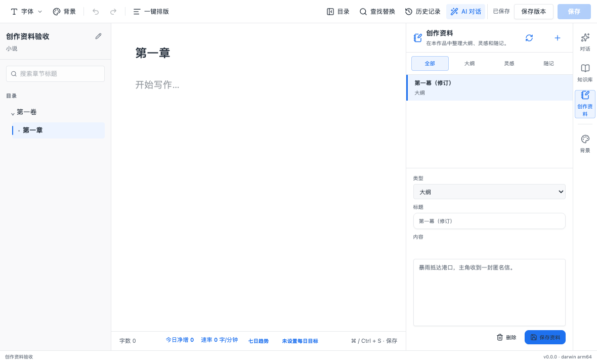

# AI 引用创作资料

## 用户行为

Ask 和 Agent 的输入区新增“引用资料”，以复选框选择当前作品的资料，并可逐条移除。选择按对话保留在当前页面内，新对话独立选择；重载后不会自动重新选择资料。

发送前重新读取所选资料，使用最新的已保存版本。资料已删除或读取失败时停止发送，保留输入并显示错误。不会发送未选择的资料，但后续对话仍会携带已完成轮次中的历史引用。

每次用户消息保存引用资料的标题、类型、版本时间、正文及原始正文长度。历史中的“已引用资料”可展开查看当次快照；之后编辑或删除原资料不会改动旧快照。每次最多选择 6 条，每条正文最多发送前 4,000 个 UTF-16 字符，总正文最多 24,000 字符。选择列表、输入区和历史快照均标示较长资料的截断状态。

创作资料在新建、切换条目或重新加载时，若存在未保存修改则要求确认放弃。未保存修改及正在保存的资料同时接入现有作品标签关闭确认，保存期间锁定编辑和切换操作。

## 实现边界

复用现有资料 IPC 读取能力，没有新增文件系统接口或 IPC 通道。Ask、Agent 及历史消息的共享契约增加可选 `creativeNotes`，严格校验数量、重复 ID、标题、时间和截断长度。请求快照与历史落盘使用同一份数据，模型提示将资料视为参考内容。

最近六个完整对话轮次继续进入模型上下文，历史引用每条正文进一步缩短至 500 字符，并保留原始长度。完整当次快照仍保存在本地历史中。Ask 保持问答行为；Agent 保持现有受控文件工具、快照审核与版本流程。

额外修复资料写入数量校验：达到 500 条时拒绝继续写入，避免保存不可再次读取的资料文件。

## 验证

- Contracts 54 项、Desktop 244 项单元测试通过，覆盖引用限制、快照不随原资料改变、历史引用缩短、Ask 提示、Agent 提示，以及资料数量溢出后的文件保护。
- 三条定向 Electron 场景通过，覆盖 Ask 最新资料引用、未选资料排除、截断提示、删除后的停止发送、输入保留、快照重载、资料切换放弃确认、标签未保存标记，以及原生 Agent 引用与连续对话。
- 仓库类型检查、构建、边界检查、格式检查及 `git diff --check` 通过。仓库 lint 无错误，保留现有四条组件 Fast Refresh 警告。
- 模型响应使用本地模拟服务，不代表真实模型的写作质量；未做 Windows 打包验收。

